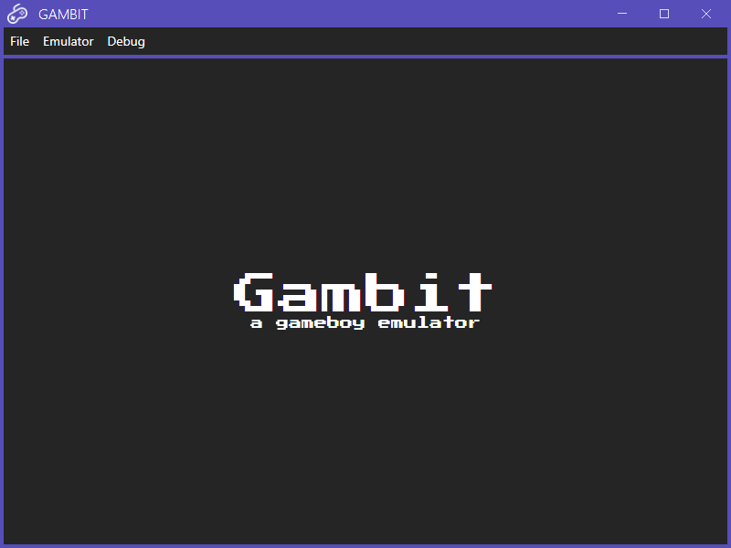
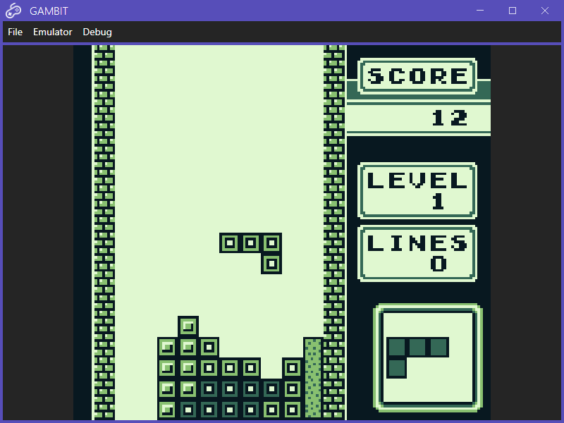
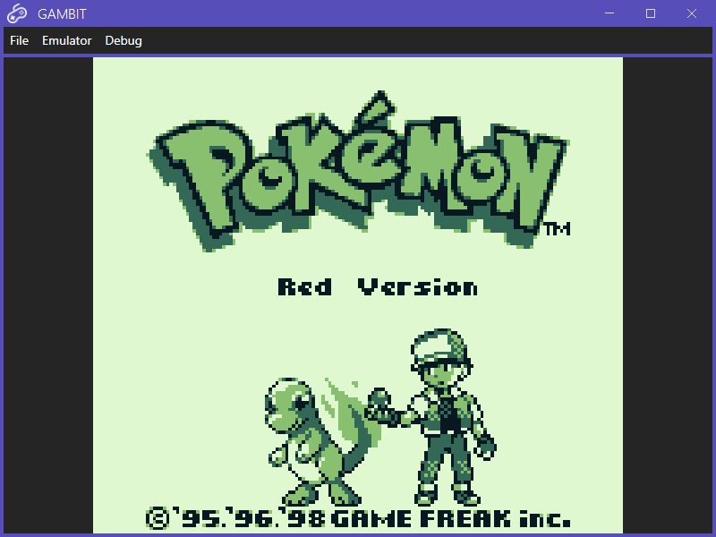
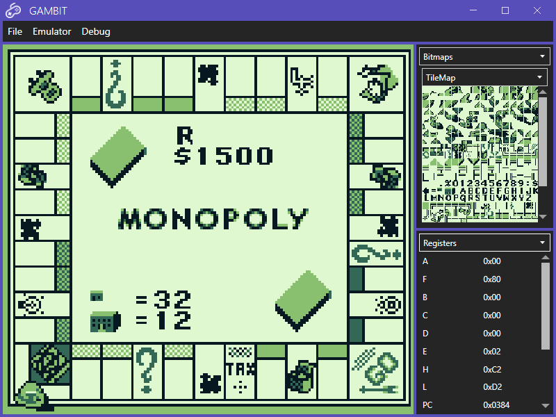

<a name="readme-top"></a>

<!-- PROJECT LOGO -->
<br />
<div align="center">
  <a href="https://github.com/DevChrome/Gambit">
    
  </a>

<h3 align="center">Gambit: a gameboy emulator</h3>

  <p align="center">
    A work-in-progress gameboy emulator made using C#, WPF and OpenTK
  </p>
</div>


<!-- TABLE OF CONTENTS -->
<details>
  <summary>Table of Contents</summary>
  <ol>
    <li>
      <a href="#about-the-project">About The Project</a>
    </li>
    <li>
      <a href="#running-from-source">Running From Source</a>
      <ul>
        <li><a href="#prerequisites">Prerequisites</a></li>
        <li><a href="#instructions">Instructions</a></li>
      </ul>
    </li>
    <li><a href="#screenshots">Screenshots</a></li>
    <li><a href="#license">License</a></li>
  </ol>
</details>


<!-- ABOUT THE PROJECT -->
## About The Project

This is an emulator for the original [gameboy](https://en.wikipedia.org/wiki/Game_Boy) (also referred to as the DMG), an 8-bit handheld game console, developed and produced by Nintendo in the 90s. It supports many (read: the few that I could get working) games that the original DMG did, such as Tetris, Pokemon Red and Monopoly (all definitely absolutely legally acquired roms!).
<br><br>
There's a core library project housing the logic for the gameboy processor, video system, address bus etc. and two frontend UIs built using WPF (windows only) and OpenTK (cross platform desktop).
<br><br>
It's a total work-in-progress, and games (even the ones that run instead of crashing) are often glitched. So keeping expectations low is good, if you decide to clone this repository.
<br><br>
No roms included though! So you'll have to, uh... *source* your own.

<!-- GETTING STARTED -->
## Running From Source

To get this project running locally from source, follow these steps:

### Prerequisites

* .NET SDK (>= 6.0)
* Visual Studio / VS Code (+ C# extensions)

### Instructions

1. Clone the repo
   ```sh
   git clone https://github.com/DevChrome/Gambit.git
   ```
2. Navigate to either of the UI directories
   ```sh
   cd Gambit.OpenTKUI
   ```
	OR
   ```sh
   cd Gambit.WpfUI 
   ```
3. `dotnet run` the project
   ```sh
   dotnet run
   ```

<!-- USAGE EXAMPLES -->
## Screenshots




<!-- LICENSE -->
## License

Distributed under the MIT License. See `LICENSE.txt` for more information.


<p align="right">[<a href="#readme-top">Back To Top</a>]</p>
